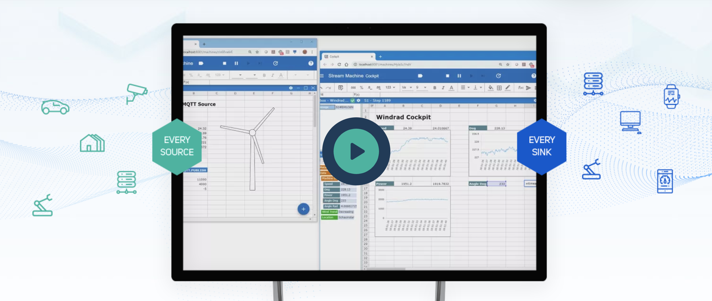

<h1 align="center">Welcome to the Livesheets core project</h1>

<div align="center">
	<!-- <a href="https://travis-ci.com/cedalo/streamsheets"
		></a> -->
	<a href="https://github.com/Macrometacorp/livesheets">
		
	</a>
	<a href="https://github.com/Macrometacorp/livesheets/graphs/commit-activity">
		
	</a>
	<br/>
	<a href="https://docs.cedalo.com/installation.html">
		
	</a>
	
	
	<br/>
	<a href="https://forum.streamsheets.com">
		
	</a>
	<a href="https://forum.streamsheets.com">
		
	</a>
	<a href="https://forum.streamsheets.com">
		
	</a>
	<!-- <a href="https://forum.streamsheets.com">
		
	</a> -->
	<a href="https://twitter.com/cedalo_com">
		
	</a>
</div>

<br/>

The Livesheet® core is an open-source tool for making your data immediately understandable and for creating IoT applications visually and interactively - without a single line of code.

<p align="center">
  
</p>

If you are new to Livesheets, you should start with the [introduction guide](https://docs.cedalo.com/introduction.html) or with the following video:

<p align="center">
  <a href="https://www.youtube.com/watch?v=fNJcIVSneH4
" target="_blank"></a>
</p>

Also, visit us on our [website](https://cedalo.com/) or check out the [Livesheets forum](https://forum.streamsheets.com/).

## Table of contents

-   [Installation](#installation)
-   [Quick start](#quick-start)
-   [Documentation](#documentation)
-   [FAQ](#faq)
-   [License](#license)

## 🔌 Installation

### Using Docker and Docker Compose

There are Docker images available for installing Livesheets on Linux, macOS, Windows and Raspberry Pi (tested with Raspbian). For each of those installations we provide a separate installer image, that facilitates the installation process.

Run the following command to execute the installer for Livesheets (replace the placeholders accordingly).

* `<PATH>`: path to the installation directory, e.g., "~/livesheets"
* `<VERSION>`: version to install, e.g., "2.0"
* `<PLATFORM>`: target platform (one of `linux`, `macos`, `rpi`, `win`)

```
docker run -v <PATH>:/streamsheets cedalo/streamsheets-installer:<VERSION>-<PLATFORM>
```

Example
```
docker run -v ~/livesheets:/streamsheets cedalo/streamsheets-installer:2.0-linux
```

<!-- ### Running from source code

TBD -->

## 🚀 Quick start

After successfully running the installer navigate to the install directory and run the start script (depending on the target platform).

For Linux:
```
cd <PATH>
sh start.sh
```

For macOS:
```
cd <PATH>
sh start.sh
```

For Windows:
```
cd <PATH>
start.bat
```

For Raspberry Pi:
```
cd <PATH>
sh start.sh
```

## 📚 Documentation

You can find the Livesheet documentation on the [documentation website](https://docs.cedalo.com/).

Check out the Getting Started page for a quick overview.

The documentation is divided into several sections:

* [Installation](https://docs.cedalo.com/installation.html)
* [Introduction](https://docs.cedalo.com/introduction.html)
* [Main Components](https://docs.cedalo.com/maincomponents.html)
* [Getting Started](https://docs.cedalo.com/gettingstarted.html)
* [Tutorials](https://docs.cedalo.com/tutorials.html)
* [Functions](https://docs.cedalo.com/functions.html)
* [Other](https://docs.cedalo.com/others.html)
* [Glossary](https://docs.cedalo.com/glossary.html)

